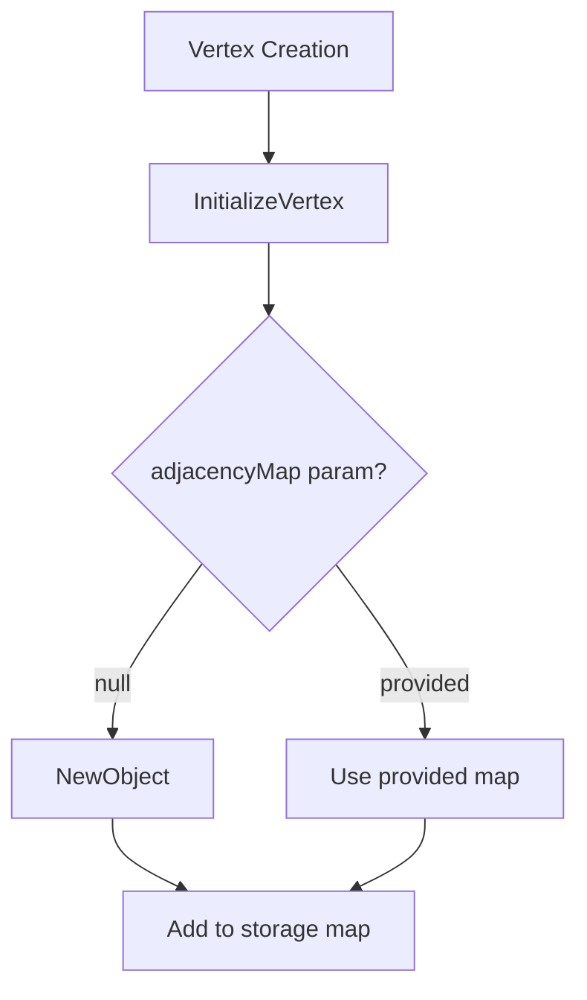
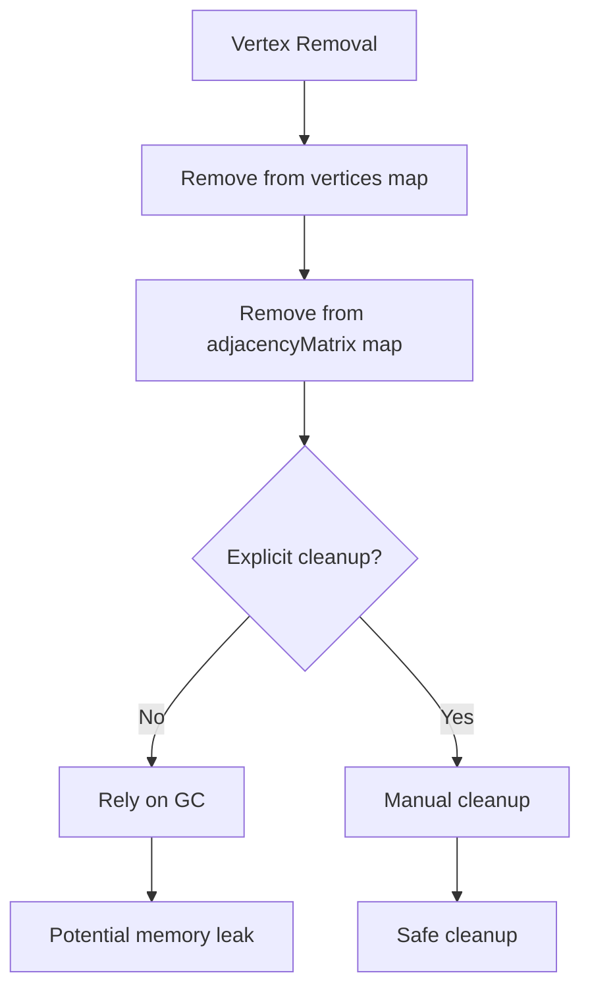

# Memory Management Audit - UAdjacencyMap

> **Project:** [[HexGraphMap]]  
> **Type:** #analysis #memory-management #audit  
> **Status:** #completed  
> **Created:** 2025-08-17  
> **Phase:** 1.2.1 of [[HexGraphMap Refactoring Plan]]

## Overview

This document audits the current [[UAdjacencyMap]] memory management patterns in the [[HexGraphMap]] project, identifying ownership issues and potential memory leaks.

**Related Documents:**
- [[Architecture Analysis]] - Overall architectural concerns
- [[Memory Management]] - Memory management strategy

---

## 🔍 Current UAdjacencyMap Usage Patterns

### Object Creation Locations

| Location | Method | Ownership | Issue |
|----------|---------|-----------|--------|
| `HexGraph.cpp:479` | `NewObject<UAdjacencyMap>(this)` | AHexGraph | ✅ Clear ownership |
| `HexGraph.cpp:511` | `NewObject<UAdjacencyMap>(this)` | AHexGraph | ✅ Clear ownership |

### Storage Maps

| Map Name | Type | Purpose | Cleanup Status |
|----------|------|---------|----------------|
| `adjacencyMatrix` | `TMap<FString, UAdjacencyMap*>` | Main vertex adjacencies | ❌ No explicit cleanup |
| `tempAdjacencyMatrix` | `TMap<FString, UAdjacencyMap*>` | Temporary operation storage | ❌ Manual cleanup required |
| `selectedPieceAdjacencyMatrix` | `TMap<FString, UAdjacencyMap*>` | Selected graph piece storage | ❌ No explicit cleanup |

---

## 🚨 Identified Memory Management Issues

### 1. **No Explicit Cleanup in Destructor**
**Issue:** `AHexGraph` doesn't have explicit cleanup for adjacency maps in destructor or `EndPlay`

**Risk:** Memory leaks if garbage collection fails to clean up properly

**Evidence:**
```cpp
// No cleanup code found in destructor or EndPlay
void AHexGraph::EndPlay(const EEndPlayReason::Type)
{
    // Empty implementation
}
```

### 2. **Manual Map Operations Without Cleanup**
**Locations:**
- `RemoveVertexAtCoord()` - Removes from maps but doesn't handle adjacency map cleanup
- `PromotePlaceholderToInstance()` - Transfers ownership without cleanup validation
- `DemoteInstanceToPlaceHolder()` - Reuses adjacency maps without validation

**Risk:** Dangling pointers and memory leaks

### 3. **Temporary Storage Without Guaranteed Cleanup**
**Issue:** `tempAdjacencyMatrix` is cleared manually but not in all code paths

**Evidence:**
```cpp
// HexGraph.cpp:594 - Manual clearing
tempAdjacencyMatrix = TMap<FString, UAdjacencyMap*>();
```

**Risk:** If exceptions or early returns occur, temporary objects may leak

### 4. **No Validation of Object Validity**
**Issue:** Code assumes `NewObject<>()` always succeeds and objects remain valid

**Risk:** Crashes due to invalid object access

---

## 📊 Memory Lifecycle Analysis

### Creation Pattern


### Destruction Pattern


---

## 🎯 Ownership Model Analysis

### Current Ownership
- **Primary Owner:** `AHexGraph` instance (via `NewObject<UAdjacencyMap>(this)`)
- **Storage:** Raw pointers in `TMap` containers
- **Cleanup:** Relies entirely on Unreal Engine garbage collection

### Issues with Current Model
1. **No explicit ownership tracking** - Can't verify all objects are properly referenced
2. **Raw pointer storage** - No automatic cleanup when map entries are removed
3. **No reference counting** - Can't detect when objects become unreachable
4. **GC dependency** - If GC fails to run or objects are somehow excluded, memory leaks

---

## 🔧 Memory Safety Violations

### Potential Dangling Pointers
```cpp
// HexGraph.cpp:300 - Removes from map but doesn't validate object
adjacencyMatrix.Remove(coord);
// Object may still exist in memory but is now unreachable
```

### Unvalidated Object Access
```cpp
// HexGraph.cpp:184 - Direct pointer dereference without validation
UAdjacencyMap* removedVertexAdjacencies = *adjacencyMatrix.Find(coord);
// No check if Find() returned valid pointer or if object is still valid
```

### Object Reuse Without Validation
```cpp
// HexGraph.cpp:326 - Reuses adjacency map without validation
adjacencyMatrix[placeHolderVertex->Coord()] = oldAdjacencies;
// No verification that oldAdjacencies is still valid
```

---

## 📋 Recommendations Summary

### Immediate Actions (High Priority)
1. **Add explicit cleanup** in `EndPlay()` and destructor
2. **Implement managed object tracking** with `UPROPERTY()` arrays
3. **Add object validity checks** before accessing adjacency maps
4. **Create cleanup helpers** for safe map operations

### Medium-Term Improvements
1. **Implement object pooling** to reduce GC pressure
2. **Add reference counting** for shared adjacency maps
3. **Create RAII wrappers** for automatic cleanup
4. **Add memory usage monitoring** and debugging tools

### Long-Term Strategy
1. **Move to value types** where possible (struct instead of UObject)
2. **Implement custom allocators** for high-frequency objects
3. **Add memory profiling** and leak detection
4. **Consider alternative storage patterns** (SOA vs AOS)

---

## 🧪 Testing Strategy

### Memory Leak Detection
1. Create large graphs (1000+ vertices)
2. Perform many create/delete cycles
3. Monitor memory usage over time
4. Use Unreal's memory profiler to detect leaks

### Stress Testing
1. Rapid vertex creation/destruction
2. Exception injection during operations
3. Forced garbage collection timing
4. Multi-threaded access patterns (if applicable)

### Validation Testing
1. Verify all created objects are properly tracked
2. Test cleanup in all code paths
3. Validate object references after removal operations
4. Test edge cases (empty maps, null pointers, etc.)

---

**Tags:** #audit #memory-management #uadjacencymap #hexgraph #claude-generated