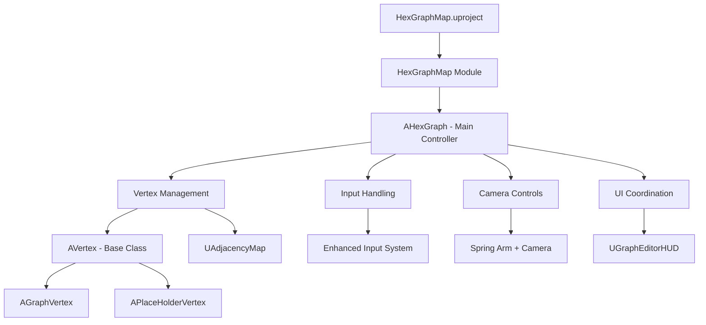

# Current Architecture - HexGraphMap

> **Project:** [[HexGraphMap]]  
> **Type:** #architecture #documentation  
> **Status:** #active  
> **Created:** 2025-08-17  
> **Last Updated:** 2025-08-17  

## Overview

This document provides detailed documentation of the existing [[HexGraphMap]] architecture as implemented, serving as a reference for understanding the current system before [[Refactoring]].

**Related Documents:**
- [[Architecture Analysis]] - Issues and improvement opportunities
- [[HexGraphMap Refactoring Plan]] - Planned architectural changes

---

## 🏗️ System Architecture

### High-Level Structure



### Core Components

#### [[AHexGraph]] - Central Controller
**Location:** `Source/HexGraphMap/HexGraph.h/.cpp`  
**Responsibilities:** 
- [[Vertex Management]] (creation, deletion, lifecycle)
- [[Input Handling]] (user interactions, camera controls)
- [[Camera Controls]] (zoom, pan, rotation)
- [[Line Drawing]] system coordination
- [[UI System]] integration
- Graph algorithm operations

**Current Issues:** [[God Object Anti-Pattern]] - too many responsibilities

#### [[Vertex]] Hierarchy
**Base Class:** `AVertex` (abstract)
- **Properties:** Row, Col coordinates, vertex type, mesh component
- **Methods:** Coordinate string conversion, basic lifecycle

**Derived Classes:**
- [[AGraphVertex]] - Concrete vertices representing actual graph nodes
- [[APlaceHolderVertex]] - Temporary vertices for editing operations

#### [[Adjacency Map]] System
**Class:** `UAdjacencyMap`
- **Purpose:** Stores connections to neighboring vertices in 6 hexagonal directions
- **Implementation:** Array of 6 coordinate strings
- **Directions:** North, Northeast, Southeast, South, Southwest, Northwest

---

## 🔧 Technical Implementation

### [[Coordinate System]]
**Current Implementation:**
- Internal: Integer row/col pairs
- Storage: String format "row:col"
- Conversion: `intsToCoordString()` and `coordStringToInts()`

**Data Structures:**
```cpp
TMap<FString, AVertex*> vertices;
TMap<FString, UAdjacencyMap*> adjacencyMatrix;
```

### [[Input System]]
**Framework:** [[Enhanced Input]] (UE5)
- **Context:** `HexGraphInputMapping`
- **Actions:** Select, StartLineDraw, Delete, Camera movements, etc.
- **Implementation:** Mixed with business logic in [[AHexGraph]]

### [[Camera Controls]]
**Components:**
- `USpringArmComponent` - Camera positioning and rotation
- `UCameraComponent` - Actual camera
- **Features:** Zoom, pan, rotation with smooth interpolation

### [[Line Drawing]] System
**Current State:**
- Preview vertices created during drawing
- Temporary vertex storage separate from main graph
- Commit/rollback functionality
- Mixed with input handling logic

---

## 📊 Data Flow

### Vertex Creation Flow
1. User input triggers vertex creation
2. [[AHexGraph]] handles input
3. Coordinates calculated from mouse position
4. Vertex spawned using `GetWorld()->SpawnActor<>()`
5. Vertex added to vertices map
6. Adjacency map created and added to adjacencyMatrix map
7. Neighboring placeholders updated

### Graph Traversal Flow
1. Algorithm starts from selected vertex
2. Recursive traversal through adjacencies
3. String coordinate lookup for each neighbor
4. Type filtering applied during traversal
5. Results accumulated in output array

---

## 🔍 Key Data Structures

### Vertex Storage
```cpp
// Primary vertex storage
TMap<FString, AVertex*> vertices;
TMap<FString, UAdjacencyMap*> adjacencyMatrix;

// Temporary storage for operations
TMap<FString, AVertex*> tempVertices; 
TMap<FString, UAdjacencyMap*> tempAdjacencyMatrix;

// Preview system
TArray<AVertex*> previewVertices;
```

### Input Mapping
```cpp
// Input actions
UInputAction* ia_Select;
UInputAction* ia_StartLineDraw;
UInputAction* ia_Delete;
UInputAction* ia_Zoom;
// ... additional actions
```

---

## 🎮 User Interaction Flow

### Basic Operations
1. **Vertex Placement:** Click on placeholder → promotes to graph vertex
2. **Vertex Removal:** Select + Delete → demotes to placeholder or removes
3. **Line Drawing:** Hold line draw key + mouse movement → creates connected vertices
4. **Navigation:** WASD + mouse wheel → camera movement and zoom

### State Management
- **Line Draw Mode:** Boolean flag `lineDrawActivated`
- **Selection State:** `previousVertexSelection` pointer
- **Hover State:** `hoverTarget` pointer  
- **Preview State:** `previewVertices` array

---

## 🧩 Module Structure

### Dependencies
```cpp
// HexGraphMap.Build.cs
PublicDependencyModuleNames.AddRange(new string[] { 
    "Core", 
    "CoreUObject", 
    "Engine", 
    "InputCore", 
    "EnhancedInput" 
});
```

### File Organization
```
Source/HexGraphMap/
├── HexGraphMap.h/.cpp          # Module definition
├── HexGraph.h/.cpp             # Main controller
├── Vertex.h/.cpp               # Base vertex class
├── GraphVertex.h/.cpp          # Concrete vertex
├── PlaceHolderVertex.h/.cpp    # Placeholder vertex
├── AdjacencyMap.h/.cpp         # Adjacency management
├── GraphEditorHUD.h/.cpp       # UI system
├── HexGraphEditorPlayerController.h/.cpp  # Player controller
├── HexagonDirection.h          # Direction enum
└── VertexType.h                # Vertex type enum
```

---

## 🔄 Lifecycle Management

### Object Creation
1. **Vertices:** Created via `GetWorld()->SpawnActor<>()`
2. **Adjacency Maps:** Created via `NewObject<UAdjacencyMap>(this)`
3. **UI Elements:** Created via Blueprint instantiation

### Object Destruction
1. **Vertices:** Destroyed via `Actor->Destroy()`
2. **Adjacency Maps:** Rely on garbage collection
3. **Cleanup:** Manual removal from maps required

### Memory Management Issues
- No explicit ownership model for adjacency maps
- Potential memory leaks if GC doesn't clean up properly
- Manual map cleanup required in many operations

---

## 🚀 Performance Characteristics

### Current Performance
- **Vertex Lookup:** O(log n) due to string-based map keys
- **Graph Traversal:** O(n!) worst case due to recursive approach without cycle detection
- **Memory Usage:** High due to string allocations and unmanaged objects

### Bottlenecks
1. String coordinate parsing and comparison
2. Recursive graph algorithms without optimization
3. Frequent object creation without pooling
4. No spatial partitioning for large graphs

---

## 🔗 Integration Points

### [[Blueprint]] Integration
- All major classes exposed to Blueprint
- UI implemented primarily in Blueprint
- Configuration and settings accessible from Blueprint

### [[Unreal Engine]] Systems
- [[Enhanced Input]] for all user interactions
- Actor/Component system for 3D representation
- UMG for user interface
- Save Game system for persistence

### External Dependencies
- Standard UE5 core modules only
- No third-party libraries
- Self-contained hexagonal grid logic

---

**Tags:** #architecture #current-state #documentation #hexgraph #claude-generated